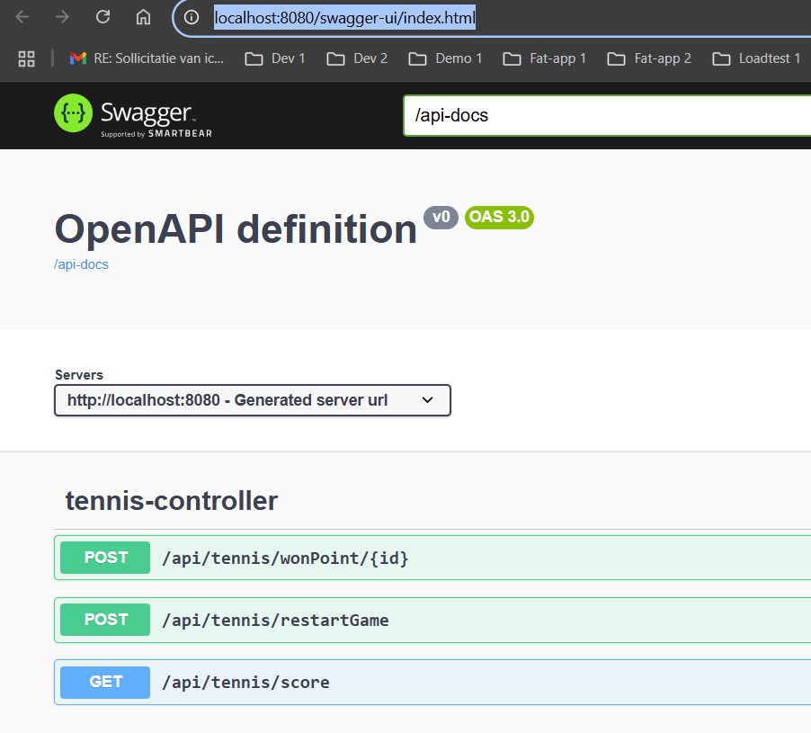
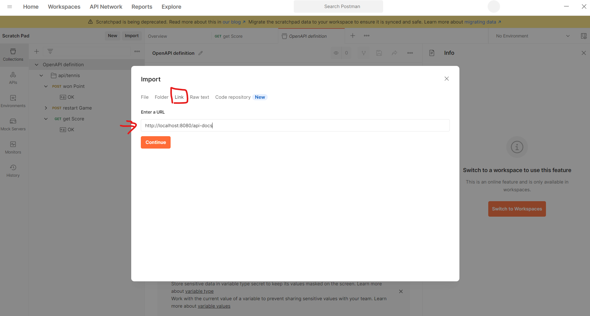

# **Tennis Game Project**

## Project Overview :

This is a RESTful Tennis Game Score Tracker application built with Spring Boot. The application provides endpoints to manage tennis matches, track scores, and determine match winners.

## Technologies Used :

1. [x] Java 17
2. [x] Spring Boot 3.4.4
3. [x] Spring
4. [x] Swagger UI (OpenAPI 2.6.0)
5. [x] Maven
6. [x] Junit

## API Documentation :

The API is documented using Swagger UI. Once the application is running, you can access the documentation at:

http://localhost:8080/swagger-ui.html

### **Available Endpoints :**

Player Management

`POST :` /api/tennis/wonPoint/{id}:

The tennis game starts with two players:

* {"id":1, "name":"playerOne"}

* {"id":2, "name":"playerTwo"}

When calling the service with the correct player ID, the current score for the corresponding player will increase by one.

`POST :` /api/tennis/restartGame :

The tennis game starts when the application is launched.
To restart the game with the default score, you should call this service

`GET :` /api/tennis/score :

This service returns the current score of the game and, if the game is finished, it will also return the winner.

## How to Compile and Run the Project

### Prerequisites :

1. [x] Java 17 JDK installed

1. [x] Maven installed

1. [ ] (Optional) Postman or you can use swagger-ui

### Compile the Project :

#### Clone the repository :

To clone project you can use git bash  or download the zip of the project and extract it.
```sh
git clone https://github.com/jdaidasedki1987/2025-DEV1-004.git
```
```sh
cd tennis
```

#### Compile with Maven :

 ```sh
mvn clean install
```

#### Run the Application :
 ```sh 
mvn spring-boot:run
```
The application will start on port 8080 by default.

## **Testing the Application :**

### Using Swagger UI :
After starting the application, open your browser and navigate to:

Link : [http://localhost:8080/swagger-ui/index.html](http://localhost:8080/swagger-ui/index.html)

* You can View all available endpoints exposed by the application.



* To test the web service, click 'Try out' on the endpoints directly from the UI, fill in the required parameters if necessary, and then click the 'Execute' button.


* See request/response models

### Using Postman :

- Open Postman application


- Import the API documentation using this link: http://localhost:8080/api-docs and click the 'Continue' button





- After importing the project, you can test the exposed endpoints.

